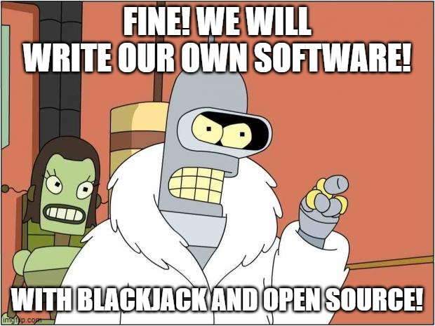

- [What is OK-API?](#what-is-ok-api)
- [What does OK-API mean?](#what-does-ok-api-mean)
- [How can I contribute?](#how-can-i-contribute)
- [OK-API Philosophy](#ok-api-philosophy)

## What is OK-API?
A long time ago in a galaxy far far away ...
Or just around the corner on planet earth, some people have been annoyed that they had all this tech and software available, and it still did not do what they wanted and needed. They had servers and workflows to manage.  They got so annoyed by tools packed with advertisement, unwanted data collection and/or overly expensive behemoths of software, that they sometime decided to write their own software. After they had their first drafts programs running in their own environments, they decided to start an organisation to bundle their useful programs, push the development further together, and put it open source so others do not need to go through this as well.  

## What does OK-API mean?
We realized soon that we had programs with totally different use case domains in our organisation. They were useful and had a purpose, but just in different domains. So our organisations projects somehow looked like the Okapi Animal ... somehow like someone took the legs from a zebra, the body of a horse, the neck of a giraffe, ears from a cow and face from an ant bear, and somehow managed to build a living and beautiful animal out of it.  
We liked the analogy as our programs on the first glance have nothing to do with each other, but you can combine them to achieve bigger use cases that serve you just right.
In addition we liked the OK-API abreviation, which looks like "Meh yeah, the API is O.K.", but really means "O.K. - Automated Procedures Initiative", which exactly describes our approach.  
We are an initative which builds O.K. programs to automate procedures, in order to make our lifes easier.

## How can I contribute?
You have an own program and want to open source it as an OK-API project? Or you like the existing projects so much that you want to help to maintain them?
Just contact us by opening an issue and ask to contribute. Make sure to read about our philosophy first, to determine if this fits your expectations. If you are interested in some background about the Ok-API license considerations, you can read about it [here](./license-considerations.md). When contacting us, please provide the following information.
- Your skills and preferred programming languages
- Description of your project / how you want to contribute
- Your favorite heavy metal band
- Anything else you want to add to give a better insight about who you are and how you want to contribute.

## OK-API Philosophy
- We should not spend a minute with manual tasks that can be automated. Automation works for us in order to free up our time, so we can listen to music more and have a barbecue. This is the core idea of OK-API.
- We believe in simplicity. This is why we have choosen to write our first programs in 'bash', even though e.g. python/ruby etc. could have been a good choice as well.  We want to provide programs that:
    - Have as few dependencies to third party programs or libraries as possible
    - Are as compatible and portable as possible
    - Need as few infrastructure and prerequisites as possible
    - Run on as many different operating system distributions as possible  
- We are doing this in our freetime, so no hurry or pressure. Sometimes it takes some time, but we keep going with OK-API.
- "If you are old and wise now, that means you have been young and stupid once." - We are all eager to learn more, and we do not blame anyone for unelegant code, bugs or flaws. We are growing with our projects. We help each other in order to better our programs and learn.

